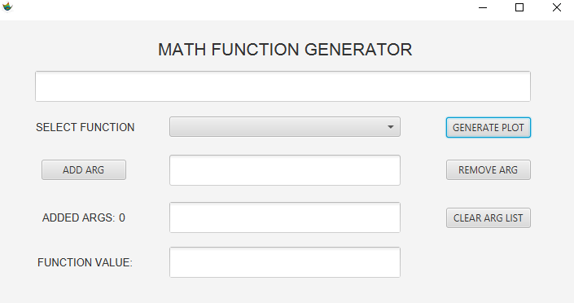
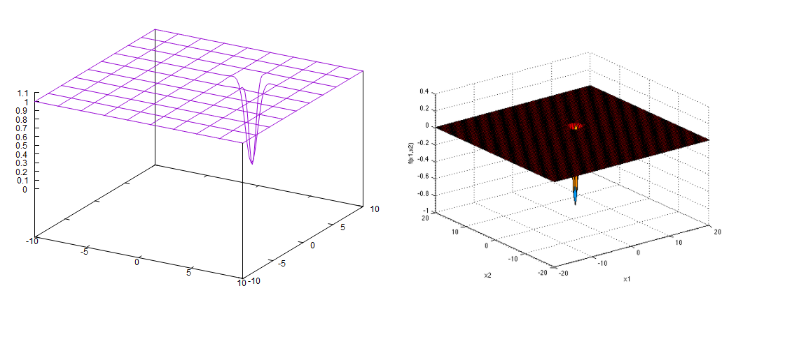
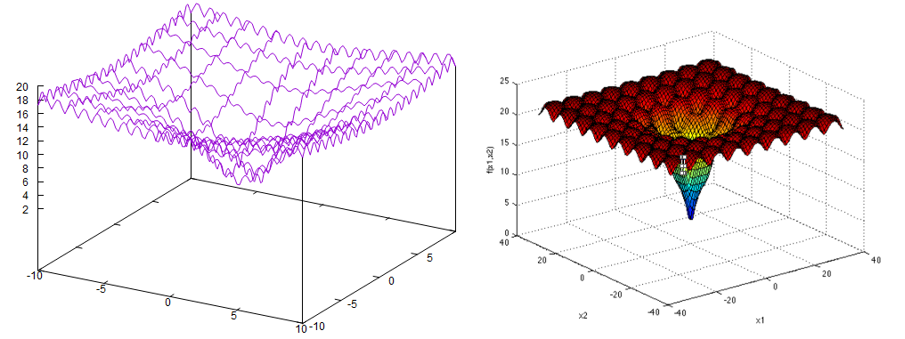

## MATH 3D FUNCTION GENERATOR
GUI application created with JavaFX and gnuplot library that allows you to generate your own 3D functions or functions available in the project. It also supports the calculation of their values.
  

    
              

 

    
              

 

    
              

### References
* [sfu.ca](https://www.sfu.ca/~ssurjano/)
